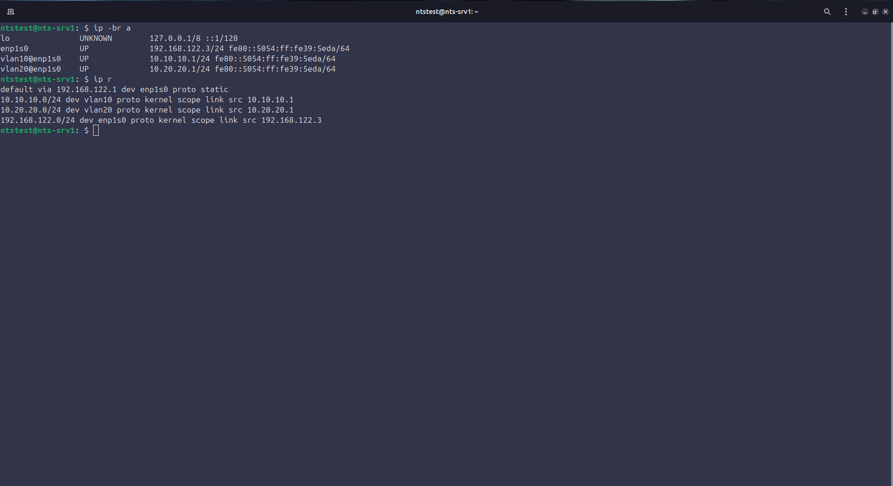
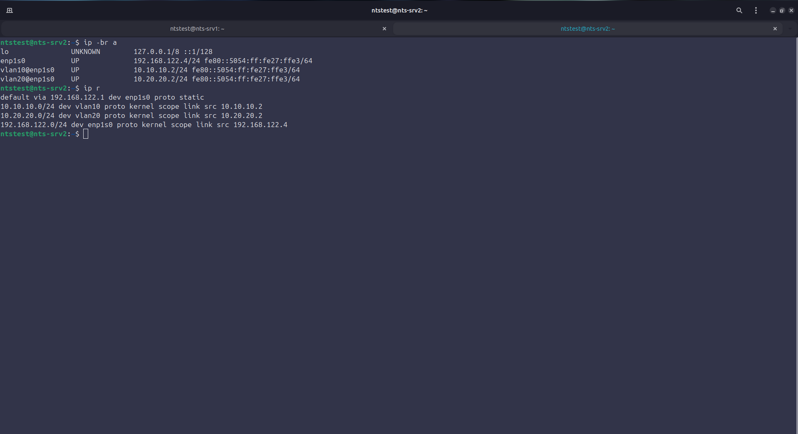
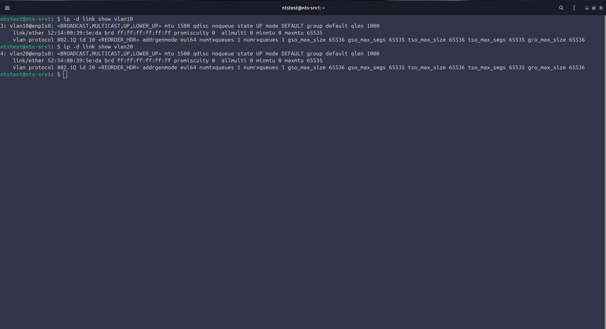
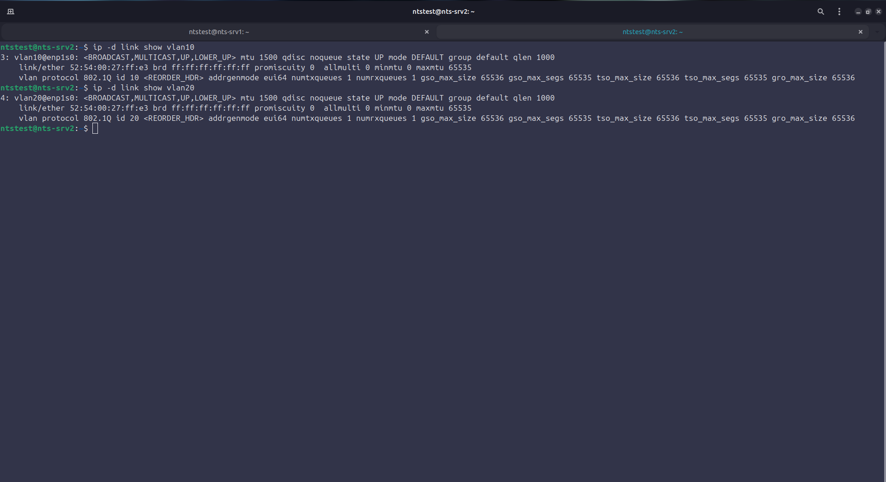
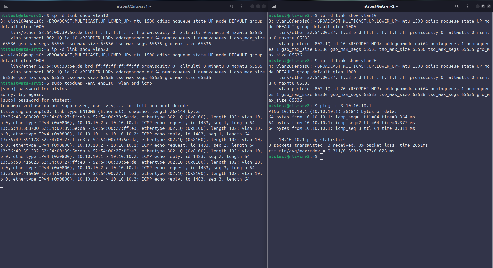
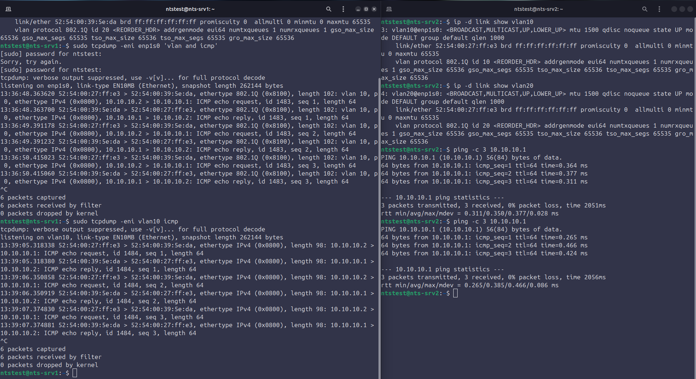
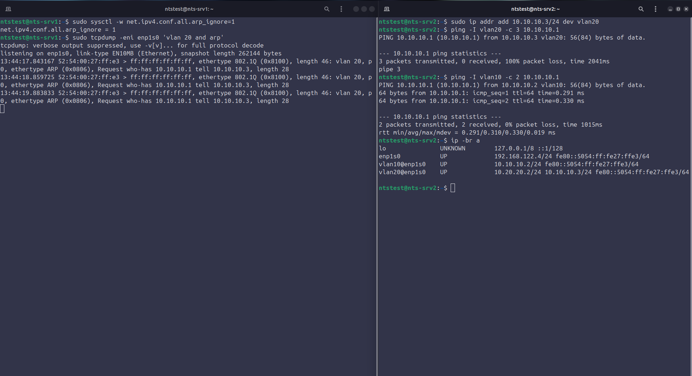
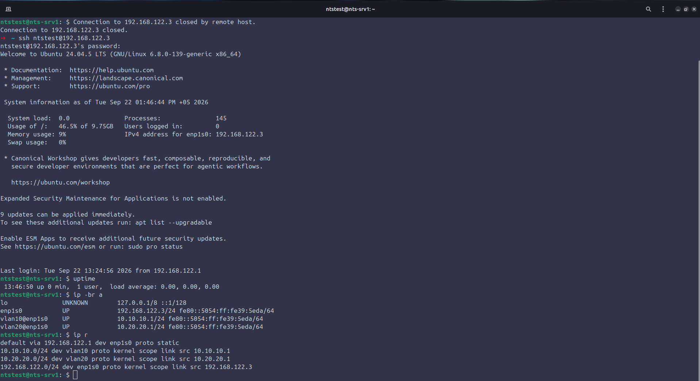

# Задание 1. Базовая настройка сети

## Цель

- Настроить статический IP-адрес на сервере
- Настроить два VLAN-интерфейса на одном сетевом адаптере
	- VLAN 10
	- VLAN 20
- Описать предназначение VLAN интерфейсов

Было реализовано на двух ВМ (Ubuntu Server 24.04 LTS), с использованием virt-manager

## Что сделано

1. Поднят стенд: KVM + virt-manager, ВМ с чистой установкой, проверка ISO по SHA256SUMS

```bash
wget -q https://releases.ubuntu.com/24.04/SHA256SUMS #Скачали оф. список контрольных сумм образов
sha256sum -c SHA256SUMS --ignore-missing
```

2. Сеть libvirt: Исходный пул DHCP был сужен (192.168.122.2-192.168.122.254 до 192.168.122.100-192.168.122.254) для выдачи статических адресов не из пула, перезапускали ВМ для того чтобы не было конфликтов с DHCP

```bash
virsh -c qemu:///system net-dumpxml default # Узнаем какие адреса раздаёт DHCP в сети default
```

```xml
<network connections='2'>

	<name>default</name>

	<uuid>da2cfa71-02d8-4741-ac02-05153ef0c0f8</uuid>

	<forward mode='nat'>

		<nat>

			<port start='1024' end='65535'/>

		</nat>

	</forward>

	<bridge name='virbr0' stp='on' delay='0'/>

	<mac address='52:54:00:02:ea:d1'/>

	<ip address='192.168.122.1' netmask='255.255.255.0'>

		<dhcp>

			<range start='192.168.122.100' end='192.168.122.254'/>

		</dhcp>

	</ip>

</network>
```

3. /etc/netplan/: В оригинале было назначение по dhcp, в 01-static.yaml были настроены статические адреса и vlan-сети, переименовали 50-cloud-init.yaml в 50-cloud-init.yaml.orig потому что в netplan последние конфигурации имеют выше приоритет чем ранние (с числовым префиксом больше) и netplan читает только *.yaml файлы
   
```yaml
# 50-cloud-init.yaml
network:
  version: 2
  ethernets:
    enp1s0:
      dhcp4: true
```

```yaml
# фрагмент 01-static.yaml
  vlans:
    vlan10:
      id: 10
      link: enp1s0
      addresses: [ "10.10.10.1/24" ]
    vlan20:
      id: 20
      link: enp1s0
      addresses: [ "10.20.20.1/24" ]
```

4. Проверил cloud-init: чтобы после перезагрузки всё не затёрлось и не применились новые настройки сети из cloud-init. Отключили путём создания /etc/cloud/cloud-init.disabled

```bash
cloud-init status
2026-09-22 09:35:01,292 - util.py[WARNING]: REDACTED config part /etc/cloud/cloud.cfg.d/99-installer.cfg, insufficient permissions
2026-09-22 09:35:01,295 - util.py[WARNING]: REDACTED config part /etc/cloud/cloud.cfg.d/90-installer-network.cfg, insufficient permissions
status: disabled
```

5. netplan generate и netplan try из консоли ВМ, а не по ssh, чтобы откатить изменения в случае если применим неверную конфигурацию и при смене адреса ssh соединение обрывается и мы не сможем подтвердить нажатием клавиши enter в netplan try чтобы применить изменения
6. Ребут и адрес на месте

## Конфигурация
Полный файл: [nts-srv1-01-static.yaml](nts-srv1-01-static.yaml)

## Проверка

```bash
ip -br a
```

<a href="screenshots/srv1-ip-addr.png"></a>
<a href="screenshots/srv2-ip-addr.png"></a>

```bash
ip -d link show vlan10 #в выводе vlan protocol 802.1Q id 10
```

<a href="screenshots/srv1-vlan-details.png"></a>
<a href="screenshots/srv2-vlan-details.png"></a>

```bash
tcpdump -ni enp1s0 -e vlan # кадр 102 байта против 98 без метки
```

<a href="screenshots/vlan-tcpdump-tagged.png"></a>
<a href="screenshots/vlan-tcpdump-untagged.png"></a>

Пинг из VLAN 10 в VLAN 20 не проходит

<a href="screenshots/vlan-isolation.png"></a>

```bash
reboot
ip -br a
```

<a href="screenshots/reboot-static-persists.png"></a>

## Почему так
VLAN нужен для разделения одной физической сети на несколько логических, чтобы ограничить рассылку трафика broadcast-домена, повышения безопасности за счёт изоляции и удобства управления.

Почему нужен адрес вне пула DHCP - dnsmasq может выдать другой машине этот адрес и будет конфликт, а так мы точно знаем что этот адрес свободен.

Почему два VLAN на одном адаптере, а не на двух разных - экономия портов и кабелей, разделения широковещательных доменов и в рамках одного сервера это проще в настройке.

Почему 01-static.yaml а не правка 50-cloud-init.yaml - меньший номер читается раньше а файл установщика при обновлении может быть перезаписан

## Проблемы и как решил
Первая попытка virsh net-edit не сохранилась, диапазон остался прежним - заметил по повторному net-dumpxml

net-destroy/net-start не проходит, пока ВМ запущены - их интерфейс подключён к virbr0, сначала выключаем машины

scp файла 50-cloud-init.yaml упёрся в Permission Denied - sudo scp не помогает (sudo действует на локальной стороне), нужно было на самой вм поменять владельца файла (chown ntstest:)

Проверка изоляции сначала провалилась, Linux по умолчанию отвечает на ARP-запрос с любого своего интерфейса, понадобился arp_ignore=1

