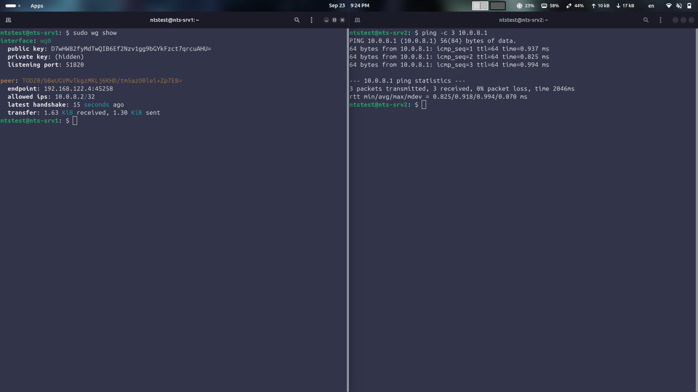
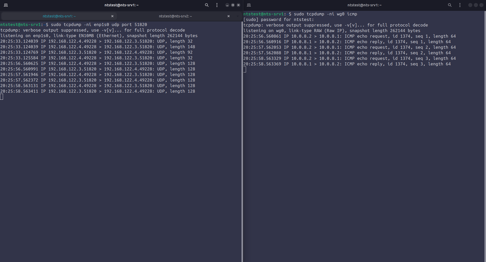

# Задание 2. Удалённый доступ

## Цель

- Настроить вход по ssh только с помощью ключа, отключить аутентификацию по паролю
- Настроить VPN для защищённого соединения

## Что сделано

1. Сгенерировали пару ключей на клиенте (nts-srv2) и скопировали публичный ключ на сервер

```bash
ssh-keygen -t ed25519

ssh-copy-id ntstest@192.168.122.3
```

2. Создали конфиг для отключения входа по паролю 10-hardening.conf в /etc/ssh/sshd_config.d/ и перезапустили sshd

```bash
sudo systemctl reload ssh
```

3. Создали ключи WireGuard на двух ВМ и wg0.conf, настроили автозагрузку в systemd

```bash
umask 077
wg genkey | tee private.key | wg pubkey > public.key

wg-quick up wg0

sudo systemctl enable wg-quick@wg0
```

## Конфигурация

[10-hardening.conf](10-hardening.conf)
- PasswordAuthentication no, PermitRootLogin no - запретили вход по паролю и под рутом

[wg0-srv2.conf.example](wg0-srv2.conf.example)
- Address = 10.0.8.2/24 - адрес клиента в vpn
- PrivateKey - приватный ключ клиента
- PublicKey - публичный ключ сервера
- AllowedIPs - какие адреса принимаем от пира и какие адреса отправляем в туннель, в данном случае 10.0.8.0/24 это все адреса которые в vpn
- PersistentKeepalive = 25 - каждые 25 секунд отправляет пустой пакет чтобы NAT и firewall не закрыли туннель
- Endpoint - ip и порт сервера
- ListenPort (wg0-srv1.conf.example) - 51820 (UDP) это порт на котором сервер слушает входящие подключения

## Проверка

Вход по паролю отключён

```bash
ssh -o PubkeyAuthentication=no ntstest@192.168.122.3
Permission denied (publickey)
```

<a href="screenshots/password_auth_disabled.png"></a>

Итоговая конфигурация sshd

```bash
sudo sshd -T | grep -Ei 'passwordauthentication|permitrootlogin'

permitrootlogin no
passwordauthentication no
```

Туннель поднят

```bash
sudo wg show #смотрим на latest handshake
```

<a href="screenshots/wg_handshake.png"></a>

Связь внутри туннеля

```bash
ping -c 3 10.0.8.1 # с srv2
```

<a href="screenshots/wireguard_vpn.png"></a>

## Почему так

- Почему вход по ключу вместо пароля - пароль могут подобрать брутфорсом, а ключ сложнее подобрать и он не передаётся по сети
- Порядок файлов в sshd_config.d - 10-hardening.conf - меньший номер читается раньше, поэтому ставим 10 чтобы настройки были заняты раньше и делали настройки из 50-cloud-init.conf бесполезными
- WireGuard, а не IPSec/OpenVPN - свой протокол поверх UDP, проще в настройке и ключи вместо сертификатов

## Проблемы и как решил

- chmod 600 на каталог /etc/wireguard вместо 700 - каталог перестал открываться, нужен бит x
- ssh-keygen -A - создаёт хостовые ключи, а не пользовательские, поэтому была проблема No identities found при ssh-copy-id
- gitleaks не давал закоммитить примеры конфигов - он ругался на публичные ключи в конфиге, заменил на заглушку
