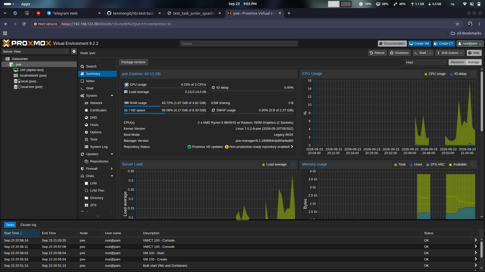
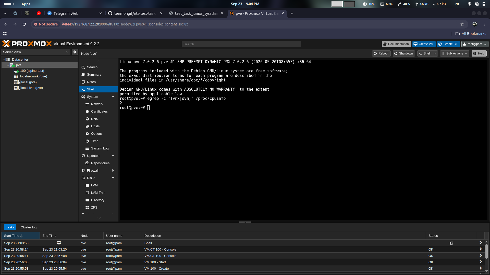
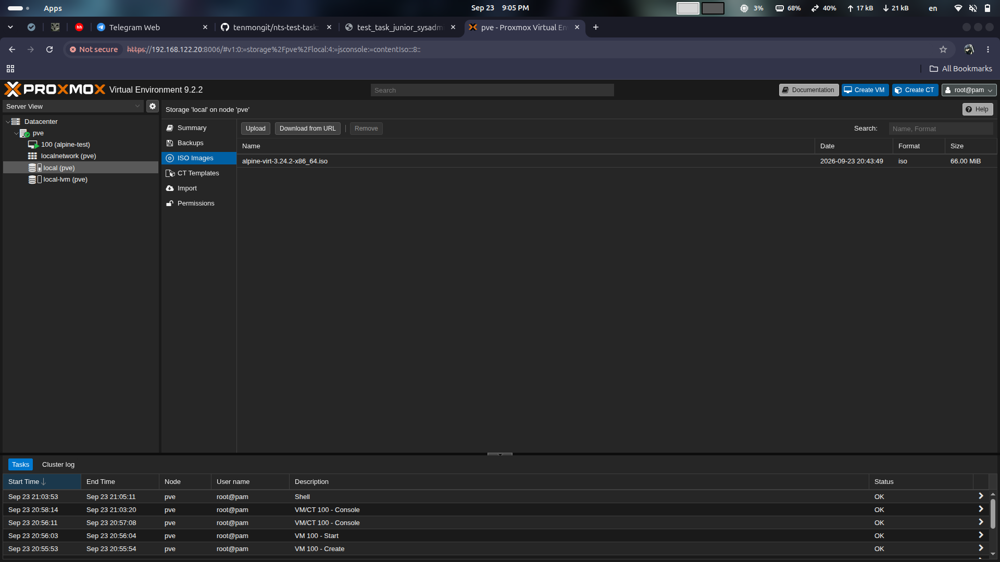
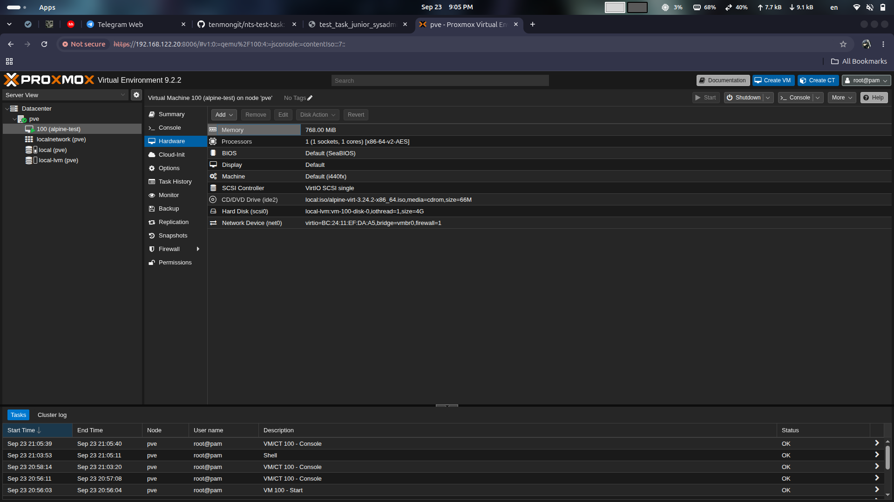
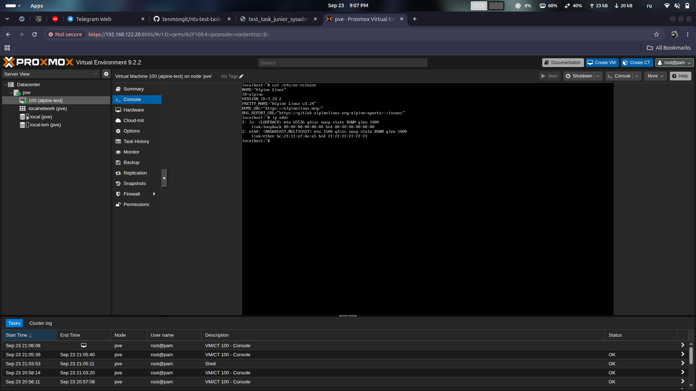
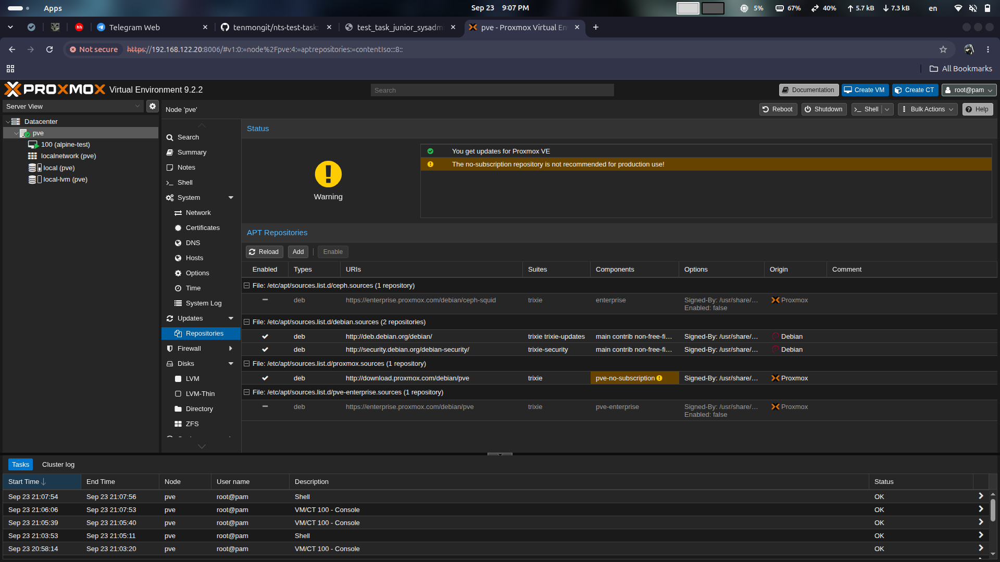

# Задание 3. Виртуализация

## Цель

- Установить Proxmox VE и поднять в нём ВМ
## Что сделано

1. Создали ВМ в virt-manager и установили в неё Proxmox VE. При установке образа выделили 4 ГБ ОЗУ и 2 ядра, диск 20 ГБ, сеть default. Также нужна настройка CPU host-passthrough для вложенной виртуализации, пробрасывает гостю флаг svm, без него внутри Proxmox не запустится KVM.
2. В самом установщике Proxmox выбрали - ext4, Asia/Almaty, CIDR 192.168.122.20/24, имя узла pve, DNS/Gateway-192.168.122.1
3. Вход в веб-интерфейс по 8006 порту
4. Переключили репозиторий с enterprise на no-subscription
5. Загрузили ISO Alpine Linux с официального сайта с помощью 'Download from URL'
6. Создана ВМ 100 alpine-test (768 МБ, 1 ядро, диск 4 ГБ на local-lvm, мост vmbr0)

## Конфигурация

[qm-config-100.txt](qm-config-100.txt) — конфигурация ВМ 100 из Proxmox

- memory - 768 МБ, потому что под сам Proxmox выделено 4
- cores - 1
- scsi0 - local-lvm:vm-100-disk-0,iothread=1,size=4G
- net0 - bridge=vmbr0,firewall=1, virtio
- ostype - l26 (обобщённое современное ядро linux)
- agent - 1 (галочка guest agent - из-за нее не сработал shutdown)
- cpu - x86-64-v2-AES

## Проверка

Proxmox установлен

Вложенная виртуализация доступна

ISO Alpine загружен через Download from URL

Параметры ВМ 100

ВМ 100 загрузилась

Репозиторий переключён на no-subscription

## Почему так
- Alpine был выбран из-за образа в 66 МБ и малого расхода ОЗУ на вложенной ВМ

- 768 МБ и диск 4 ГБ - потому что сам Proxmox работает в ВМ с 4 ГБ ОЗУ

- cpu: x86-64-v2-AES у ВМ 100 — обычная модель: host-passthrough нужен был внешней ВМ, а Alpine сам никого не виртуализирует.

## Проблемы и как решил
- проблема с enterprise репозиторием, ввиду отсутствия подписки обновления не проходят - переключился на no-subscription
- через интерфейс не получилось выключить alpine-test - пришлось вручную с командой poweroff в самой консоли alpine выключить машину, потому что Proxmox ждал ответа от guest agent которого в live-образе нет
